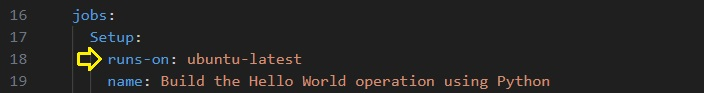
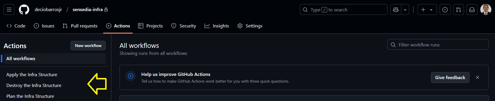

# Sensedia Infra Structure for HelloWorld
 
This repository holds the Terraform Config Files to deploy the required infra structure to be used to delivery the application. 

The objective is creating an infra structure to be used by the Sensedia Apl to delivery a simple Hello World. 
 
This Repository has the following folder structure:
  

* AWS-Resources - This folder contains all the AWS resources to be provisioned by layers as the best practices suggests:  
	* **L0-vpc**: will create all nework resources
	* **L1-eks**: will create de Cluster and the Node Group
	* **L2-irsa**: will provision the (IRSA) IAM Role for Service Account to allow the required access the AWS Resources from the cluster.
	* **L3-alb**: will be responsible for installing the ALB Controller on the cluster.
  

## Requirements to deploy the infra structure

### The runs-on Ubuntu Image
On This challenge i´m using the simple ubuntu:latest and installing all the tools and packages needed. This was done for simplicity. On a production environment, the best approach is creating repository/pipeline to create and devivery the images used by the company using specific workflows for this task. Some companies go even far by including the image´s SHA with the image name. In our challenge workflow, we could have a build and a deploy image. 

    

### Required repositories
This challenge uses two GitHub repositories as described bellow: 

> **sensedia-infra**: This GitHub repository will hold the infra structure provisioning config files. 
> **sensedia-apl**: This GitHub repository will hold the application, help and delivery terraform config files. 
 

### Required secrets

You should make available to your github repository the following secret(s) to be able to run the pipeline to deploy the application.  
NOTE: Remember that on a free GitHub tier, the secrets should be created per repository once the free tier doesn´t allow the inheretance of the secrets from the organization. 
On a production environment, a secret like the GitHub PAT should be on the Organization level on GitHub. 
 
Use the following direction to create your secret inside the repository:  <your_repo>->Settings->Secrets and variables->Actions->Secrets and click the button "New repository secret".

PAT_DECIO_GITHUB: to hold your PAT(Personal Access Token) with all the required access to run the pipeline. If you have your own PAT available on GitHub, you may just change the actual PAT_DECIO_GITHUB with your secret on the .github/workflows. 
AWS_ACCESS_KEY_ID: This is your AWS access key ID. This access key ID, along with a corresponding secret access key, is used to authenticate and authorize requests made to AWS services via the AWS Command Line Interface (CLI).If you have your own AWS_ACCESS_KEY_ID available on GitHub, you may just change the actual AWS_ACCESS_KEY_ID with your secret on the .github/workflows. 
AWS_SECRET_ACCESS_KEY: This is your AWS secret access key. If you have your own AWS_SECRET_ACCESS_KEY available on GitHub, you may just change the actual AWS_SECRET_ACCESS_KEY with your secret on the .github/workflows. 
TF_TOKEN_APP_TERRAFORM_IO: This secret is used to authenticate Terraform Cloud or Terraform Enterprise when running Terraform commands. It stores the personal access token that grants access to your Terraform Cloud or Terraform Enterprise account.

### Required variables

AWS_REGION: The region used to create the resources. The same region as the one used to create the infra structure. 
 

# Provisionnig the infrastruture

This Repository may be used on 4 different cluster/application arquitectures combining the use of Public/Private subnets for the worker nodes and internal/internet-facing for the Load Balancer Schema on the application side. 

> To choose between the private/public subnets, change the following variable: 
 AWS-Resources -> L1-eks -> terraform.tfvars -> pub-priv-sel 

NOTE: for this challenge the variable will be set as private. 

 
The infra structure provisioning is a manually triggered workflow on GitHub.  
The available workflows are the following: 

* **Apply the Infra Structure**: Used to provision the infrastructure. 
* **Destroy the Infra Structure**: Used to destroy the infra struture provisioned. 
* **Plan the Infra Structure**: Used to check the Terraform Plan before appling any push on the repository.  

    

 
To trigger a workflow, just click on it´s name as illustrated above. 

## Cluster and Node Group delivered on Public Subnets and internet-facing Load Balancer
The following image illustrates the choosed architecture for the challenge implementation. 
The work-nodes will be delived on a Private NetNetwork. 
In general, this is a good alternative for client facing applications. 

The figure above illustrate that we are using the internet-facing as the Service Scheme for all three application.

 

## The Terraform State Files Management
For the purpose of this challenge, i decided to use the an AWS S3 Bucket to hold state files making all of then available to be used by the sensedia-apl repository during the application deployment. 
The S3 Bucket will have the following structure:br>

